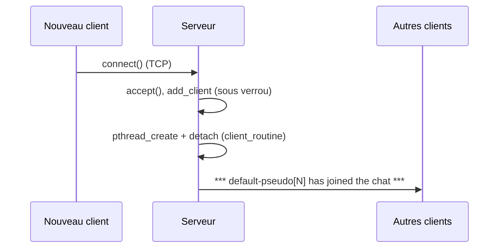
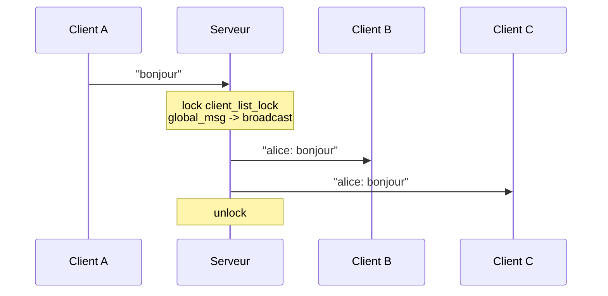
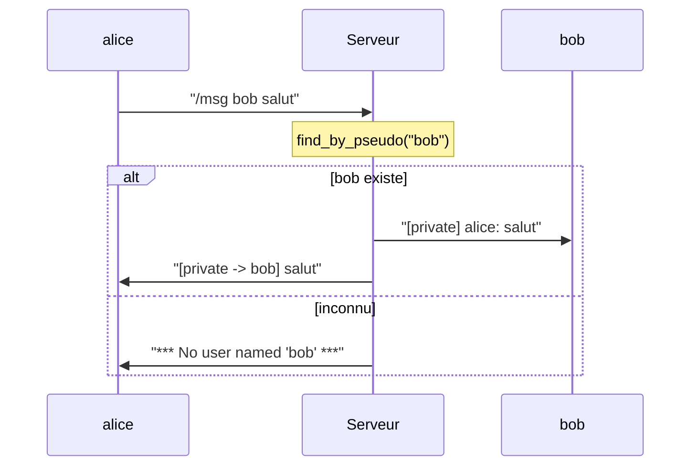
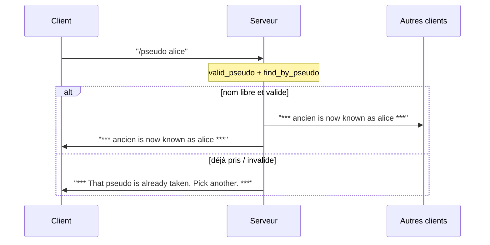
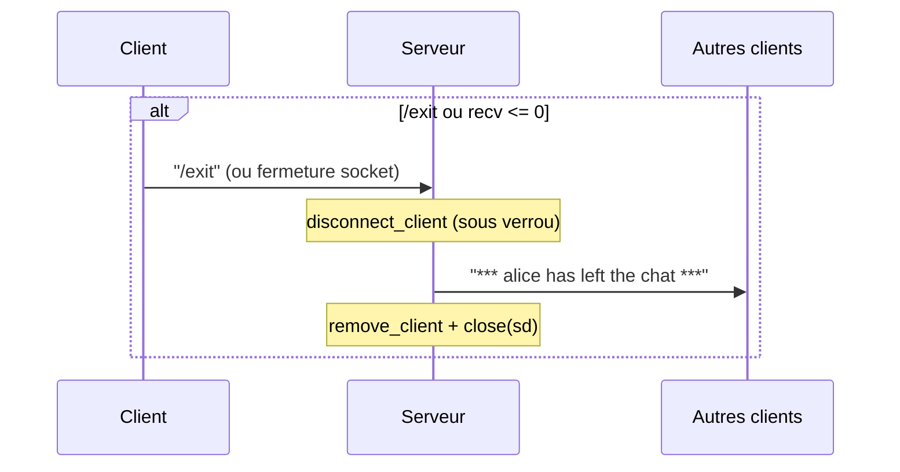

# Documentation — Architecture & messages échangés

Document de référence pour ChatHub : vue d'ensemble, modèle de threads, structures
de données, et description des messages échangés (avec diagrammes de séquence).

---

## 1. Vue d'ensemble

Un **serveur** central accepte les connexions TCP et relaie les messages entre tous
les **clients** connectés. Chaque client dialogue avec le serveur via une connexion
TCP dédiée ; les clients ne communiquent jamais directement entre eux.

```
        +-----------------------------------------------+
        |                   SERVEUR                     |
        |                                               |
        |   thread principal : accept() en boucle       |
        |        |                                      |
        |        v          liste chainee de clients    |
        |   [client_list] --> C1 -> C2 -> C3 -> NULL     |
        |        ^            (protegee par             |
        |        |             client_list_lock)         |
        |   1 thread detache par client :               |
        |     client_routine(C1) ... (C2) ... (C3)       |
        +----^------------------^------------------^-----+
             | TCP              | TCP              | TCP
             |                  |                  |
        +----+----+        +----+----+        +----+----+
        | Client1 |        | Client2 |        | Client3 |
        | recv th |        | recv th |        | recv th |
        | send th |        | send th |        | send th |
        +---------+        +---------+        +---------+
```

---

## 2. Modèle de threads

### Serveur
- **1 thread principal** : boucle `accept()`. Pour chaque nouvelle connexion il insère
  un nœud dans `client_list` (sous verrou) puis lance un thread de service.
- **1 thread détaché par client** (`client_routine`) : boucle `recv()`, interprète les
  commandes, diffuse les messages. Détaché via `pthread_detach` → nettoyage automatique
  à la déconnexion.

### Client
- **Thread de réception** (`recv_thread_entry`) : boucle `recv()` et affiche.
- **Thread d'émission** (`send_thread_entry`) : lit `stdin` et envoie.
- Le **thread principal** attend la fin du thread d'émission (`pthread_join`) puis ferme.

### Synchronisation (serveur)
Un **unique mutex** `client_list_lock` protège :
- le parcours **et** la modification de la liste chaînée ;
- toute la diffusion (`broadcast`, `global_msg`, `private_msg`, annonces).

Règle invariante : `send_all` ne verrouille **jamais** — il est toujours appelé par une
fonction qui détient déjà `client_list_lock`. (Reverrouiller un mutex non récursif
provoquerait un auto-blocage.)

---

## 3. Structures de données

```c
struct Client {
    char pseudo_name[100];      // pseudo affiché (unique, sans espaces)
    struct sockaddr_in c_addr;  // adresse du client
    socklen_t sk_addr_len;
    int sd;                     // descripteur de socket
    struct Client *next;        // liste chaînée simple
};

struct Client_head {            // tête de liste
    struct Client *head;
    int size;
};
```

---

## 4. Messages échangés

### 4.1 Client → Serveur (texte brut)

| Saisie | Interprétation serveur |
|--------|------------------------|
| `bonjour tout le monde` | message public |
| `/pseudo alice` | demande de changement de pseudo |
| `/msg bob salut` | message privé à `bob` |
| `/exit` | déconnexion |

### 4.2 Serveur → Client (texte mis en forme)

| Catégorie | Format envoyé |
|-----------|---------------|
| Message public | `alice: bonjour tout le monde` |
| Privé (destinataire) | `[private] alice: salut` |
| Privé (accusé expéditeur) | `[private -> bob] salut` |
| Arrivée | `*** alice has joined the chat ***` |
| Départ | `*** alice has left the chat ***` |
| Renommage | `*** default-pseudo[0] is now known as alice ***` |
| Pseudo refusé | `*** That pseudo is already taken. Pick another. ***` |
| Pseudo invalide | `*** Pseudo can't be empty or contain spaces. ***` |
| Destinataire inconnu | `*** No user named 'bob' ***` |
| Mauvais usage | `*** Usage: /msg <pseudo> <message> ***` |

---

## 5. Diagrammes de séquence

### 5.1 Connexion d'un nouveau client



### 5.2 Message public



### 5.3 Message privé



### 5.4 Changement de pseudo



### 5.5 Déconnexion



---

## 6. Cycle de vie d'un message (côté serveur)

1. `recv()` lit les octets, ajoute `'\0'`.
2. Test de déconnexion (`recv ≤ 0` ou `/exit`) → `disconnect_client`.
3. Sinon, test des préfixes : `/pseudo ` → renommage ; `/msg ` → `private_msg`.
4. Sinon → `global_msg` (message public).
5. Les étapes 3–4 s'exécutent sous `client_list_lock`, et utilisent `broadcast` /
   `send_line` qui appellent `send_all` (sans reverrouillage).
